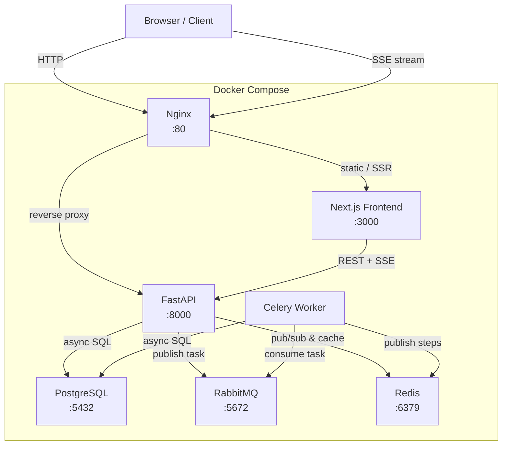
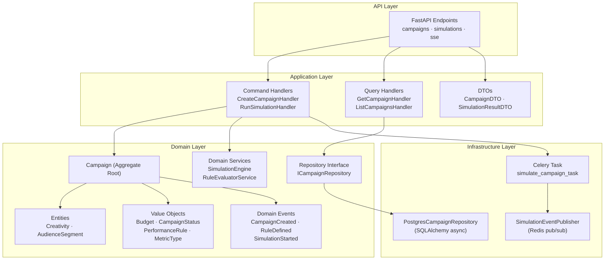
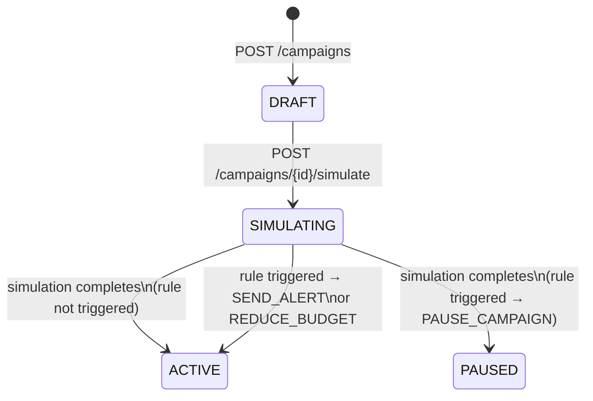
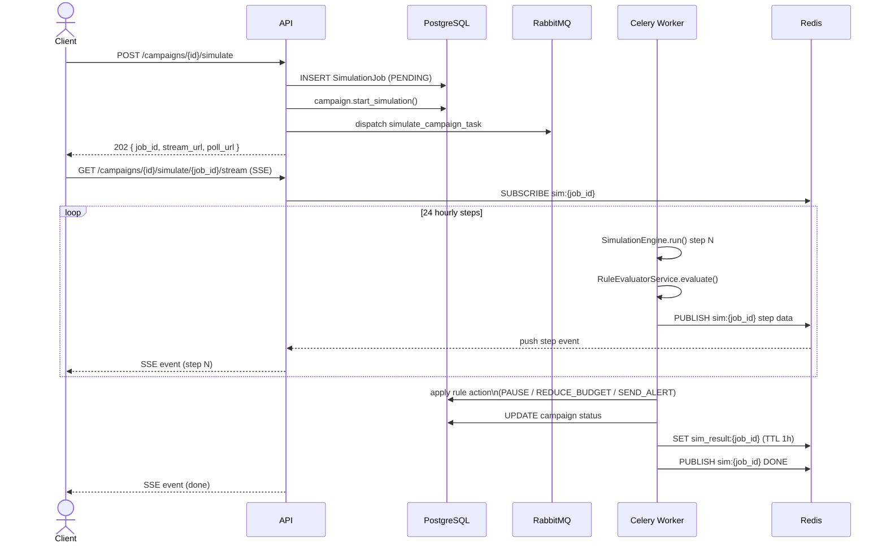
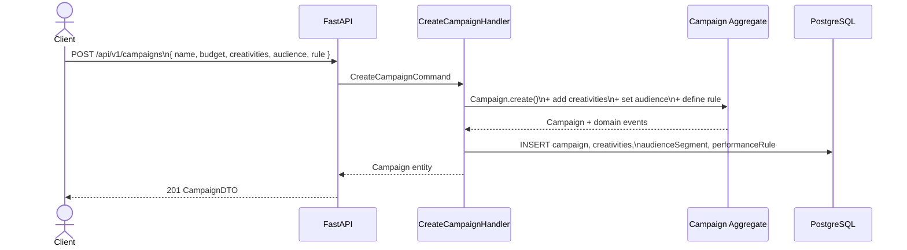
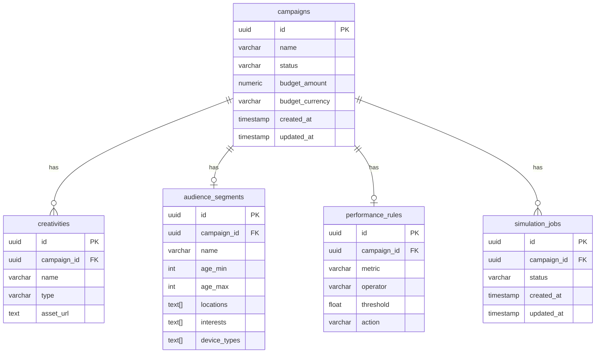

# Architecture

## 1. System Overview

---

## 2. Backend Layer Structure — `backend/src/` (DDD)

---

## 3. Campaign Lifecycle

---

## 4. Simulation Flow

---

## 5. Request Flow — Create Campaign

---

## 6. Data Model

